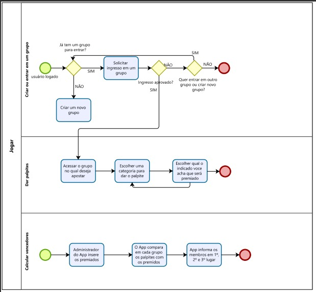
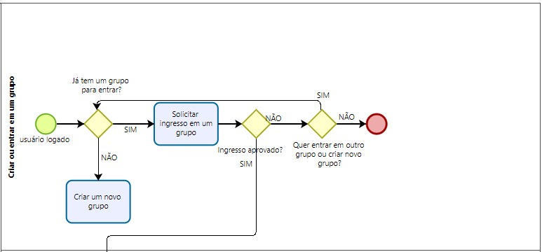

# Especificações do Projeto

Pré-requisitos: <a href="1-Documentação de Contexto.md"> Documentação de Contexto</a>

## Personas

| `Persona` | `Idade` | `Descrição` | `Como interage com seus grupos de palpite` | `Como descobre onde assistir aos indicados` | `Como palpita`  | 
|:-----------:|:---------:|:-------------:|:---------------------------------:|:--------------:|:----------------:|:------------:|
|Murilo Tiago Martins|38 anos|Advogado por formação e servidor público. Gosta de cinema, teatro, música e artes em geral. Acompanha todas as premiações do circuito de cinema, música e teatro, entre elas inclui o Oscar|WhatsApp e Facebook |Indicações de amigos e buscas pelo google.|Respostas aleatórias no whatsApp e/ou planilhas de excel.|
|Ian Osvaldo Oliver da Rocha|29 anos|Estudante de Ciência da computação a ama cinema, e música. Acompanha todas as premiações do circuito de cinema, música e teatro, entre elas inclui o Oscar|WhatsApp e Facebook e chats de comunidades voltadas para o tema|Indicações de amigos e buscas pelo google.|Respostas aleatórias nas comunidades que participa e/ou planilhas de excel.|
|Adriana Marcela Freitas|14 anos|Estudante do ensino fundamental e acabou de começar a interagir mais com um grupo de pessoas que costumas seguir as premiações do circuito e se interessar por cinema e teatro. Sonha em ser atriz|WhatsApp, Facebook, e amigos |Indicações de amigos e buscas pelo google.|planilhas de excel.|
|Bruno Márcio da Costa|30 anos|Web designer, trabalha com uma pessoa que ama acompanhar o oscar e recentemente o qustionou sobre seus palpites|chat da empresa |Indicações de amigos.|Planilhas de excel.|
## Histórias de Usuários

Com base na análise das personas forma identificadas as seguintes histórias de usuários:

|EU COMO... `PERSONA`| QUERO/PRECISO ... `FUNCIONALIDADE` |PARA ... `MOTIVO/VALOR`                 |
|--------------------|------------------------------------|----------------------------------------|
|Eu, administrador da aplicação|quero incluir a lista de indicados da edição atual|para disponibilizar aos usuários que palpitem antes da cerimônia.|
|Eu, Murilo|criar um grupo de palpites|para brincar com meus amigos quem acerta mais vencedores entre os indicados.|
|Eu Adriana|ver a realação do indicados a este anos e onde assistir|para conseguir assistir ao máximo de filmes possíveis antes da cerimônia e poder palpitar melhor. | 
|Eu, Bruno|desejo palpitar após ser questionado à respeito no grupo formado pelo meu colega de trabalho|para poder participar da brincadeira.|
|Eu, Ian|incluir uma resenha sobre algum indicado|para discutir em meu grupo, meus pensamentos sobre alguma indicado em específico.|
|Eu, qualquer membro do grupo|quero palpitar sobre quem eu acho que ganhará cada categoria|para participar da brincadeira.|
|Eu, qualquer membro do grupo|quero saber quem do meu grupo ganhou no jogo dos palpites|para saber se foi eu ou quem foi que ganhou.|
|Eu, qualquer membro do grupo|quero ver a lista de ganhadores|para saber quais palpites eu acertei ou errei.|
|Eu, criador/administrador de algum grupo|quero incluir alguém no grupo|para permitir que um amigo jogue comigo.|
|Eu, criador/administrador de algum grupo|quero permitir ou negar a entrada de alguém no emu grupo|para evitar a entrada de pessoas desconhecidas ou não autorizadas.|
|Eu, amigo de algum criador/administrador de algum grupo|quero fazer parte do grupo|para jogar com eles.|

## Modelagem do Processo de Negócio 

### Análise da Situação Atual
Hodiernamente não existem aplicações para que os apaixonados pela premiação possam dar seus palpites. O que os grupos fazem hoje é comentarem entre si ou em chats sobre o tema ou fazer planilhas de excel para jogarem entre pequenos grupos

### Descrição Geral da Proposta

Criação de uma página web com informações da premiação do ano, informações sobre os indicados, e jogo de palpites sobre possíveis indicados que receberão os prêmios.
Criar um jogo em que cada membro pode jogar entre grupos diferentes, e aqueles que acertarem mais palpites ganham os jogos.

### Processo 1 – Criar ou Entrar em um Grupo

### Processo 2 – Dar Palpite

### Processo 3 – Calcular membros vencedors

## Indicadores de Desempenho

Apresente aqui os principais indicadores de desempenho e algumas metas para o processo. Atenção: as informações necessárias para gerar os indicadores devem estar contempladas no diagrama de classe. Colocar no mínimo 5 indicadores. 

Usar o seguinte modelo: 

Obs.: todas as informações para gerar os indicadores devem estar no diagrama de classe a ser apresentado a posteriori. 

## Requisitos

As tabelas que se seguem apresentam os requisitos funcionais e não funcionais que detalham o escopo do projeto. Para determinar a prioridade de requisitos, aplicar uma técnica de priorização de requisitos e detalhar como a técnica foi aplicada.

### Requisitos Funcionais

|ID    | Descrição do Requisito  | Prioridade |
|------|-----------------------------------------|----|
|RF-01| O aplicativo deve apresentar uma tela de login para autenticação de usuários cadastrados.| `ALTA` | 
|RF-02| O aplicativo deve apresentar um botão na tela de login para cadastro de novos usuários através de um formulário.   Este formulário deve conter:   * Nome   * Data de nascimento   * E-mail   * Senha  | `ALTA`|
|RF-03| O aplicativo deve apresentar um botão para criar novo grupo via formulário.   Este formulário deve conter:   * Nome   * botão de incluir usuários   * botão de convidar novos participantes   * Senha de administrador  | `ALTA`|
|RF-04| O aplicativo deve apresentar um botão dentro da página de cada grupo para convidar novos participates. | `ALTA`|
|RF-05| O aplicativo deve apresentar um botão na capa do grupo, de junte-se ao grupo | `ALTA`|
|RF-06| O aplicativo deve apresentar uma central de notificações por grupos e uma para aplicação | `ALTA`|
|RF-07| O aplicativo deve apresentar na central de notificações uma lista de membros que querem entrar no grupo | `ALTA`|
|RF-08| O aplicativo deve apresentar na lista de membros que querem entrar no grupo, as opções de permitir e negar | `ALTA`|
|RF-09| O aplicativo deve apresentar as bandeirinhas dos idiomas PT, EN para alternar entre versões de idiomas diferentes | `BAIXA`|
|RF-10| O aplicativo deve apresentar uma lista de indicados ao oscar | `ALTA`|
|RF-11| O aplicativo deve apresentar na lista de indicados ao oscar, a opção de visualizar para cada indicado | `ALTA`|
|RF-12| O aplicativo deve apresentar um raking de melhores palpiteiros por grupo | `ALTA`|
|RF-13| O aplicativo deve permitir edição dos palpites até o horário do início da transmissão da cerimônia de premiação | `ALTA`|
|RF-14| O aplicatibvo deve apresentar, dentro de cada descrição de cada indicado, onde assistir com redirecionamento para a página do straming caso o filme esteja disponível em algum streaming.| `MEDIA` |
|RF-15|O aplicativo deverá consumir de uma API com as informações referentes aos indicados.| `ALTA` |
|RF-16|O aplicativo deverá possibilitar um mecanismo de busca por categoria, por nome, por streming.|`MÉDIA`|
|RF-17|O aplicativo deverá consumir de uma API com a lista de vencedores.| `ALTA` |

### Requisitos não Funcionais

A tabela a seguir apresenta os requisitos não funcionais que o projeto deverá atender.

|ID     | Descrição do Requisito  |Prioridade |
|-------|-------------------------|----|
|RNF-01|As informações cadastrais do usuário devem estar disponíveis apenas para o usuário.|`ALTA`| 
|RNF-02|O site deverá utilizar tecnologias como React Native |`ALTA`| 
|RNF-03|O aplicativo deve ser compatível com os sistemas operacionais Android e IOS.|`ALTA`|
|RFN-04|O layout do aplicativo deverá se atentar aos requsitos de acessibilidade recomendados pelo W3C, principalmente no que concerne atender pessoas com deficiência visual, com deficiência auditiva e com Daltonismo|`MEDIA`|

## Restrições

O projeto está restrito pelos itens apresentados na tabela a seguir.

|ID| Restrição                                             |
|--|-------------------------------------------------------|
|RE-01|O projeto deverá ser entregue funcionando no final do semestre letivo, sem ultrapassar a data 22/06/2022.|
|RE-02|A equipe não pode subcontratar o desenvolvimento do trabalho|
|RE-03|A equipe desenvolverá o projeto com os integrantes que compõem o grupo e todos deverão estar cientes sobre as funcionalidades do código e sistema.|

## Diagrama de Casos de Uso

O diagrama de casos de uso é o próximo passo após a elicitação de requisitos, que utiliza um modelo gráfico e uma tabela com as descrições sucintas dos casos de uso e dos atores. Ele contempla a fronteira do sistema e o detalhamento dos requisitos funcionais com a indicação dos atores, casos de uso e seus relacionamentos. 

As referências abaixo irão auxiliá-lo na geração do artefato “Diagrama de Casos de Uso”.

A seguir encontram-se os Casos de Uso e o Diagrama de Casos de Uso.

| Caso de Uso| Descrição|
|:-----------:|:---------:|
|Cadastro de novo usuário|Cadastra um novo usuário, caso o usuário já esteja cadastrado no aplicativo, deve retornar a mensagem "Usuário já cadastrado" |
|Fazer login|Recebe as credenciais já cadastradas do usuário e em seguida é encaminhado para Verificar Credenciais.|
|Verificar Credenciais|Verifica e valida as credenciais do usuário. Caso estejam incorretas então o sistema irá exibir erro de login.|
|Palpites|Registra o palpite feito pelo usuário.|
|Resultados|Compara os ganhadores com os palpites e rankeia os palpiteiros mais eficientes.|
|Assistir indicado|Redireciona o usuário para plataforma de streming onde o indicado está disponível ou recomenda onde assistir se só estiver disponível nos cinemas.|
|Pesquisar indicados|Exibir os resultados de acordo com a busca do usuário.|

|Ator|Descrição|
|:-----------:|:---------:|
|Usuário sem cadastro|Poderá ter acesso à lista de indicados mas não pode entrar em grupos nem palpitar.|
|Usuário com cadastro|Poderá ter acesso à lista de indicados, pode criar ou entrar em grupos, pode participar dos palpites.|
|API|Irá fornecer as informações sobre os os indicados.|
|API|Irá fornecer a lista dos vencedores após a cerimônia.|

# Matriz de Rastreabilidade

A matriz de rastreabilidade é uma ferramenta usada para facilitar a visualização dos relacionamento entre requisitos e outros artefatos ou objetos, permitindo a rastreabilidade entre os requisitos e os objetivos de negócio. 

A matriz deve contemplar todos os elementos relevantes que fazem parte do sistema, conforme a figura meramente ilustrativa apresentada a seguir.

> **Links Úteis**:
> - [Artigo Engenharia de Software 13 - Rastreabilidade](https://www.devmedia.com.br/artigo-engenharia-de-software-13-rastreabilidade/12822/)
> - [Verificação da rastreabilidade de requisitos usando a integração do IBM Rational RequisitePro e do IBM ClearQuest Test Manager](https://developer.ibm.com/br/tutorials/requirementstraceabilityverificationusingrrpandcctm/)
> - [IBM Engineering Lifecycle Optimization – Publishing](https://www.ibm.com/br-pt/products/engineering-lifecycle-optimization/publishing/)

# Gerenciamento de Projeto

De acordo com o PMBoK v6 as dez áreas que constituem os pilares para gerenciar projetos, e que caracterizam a multidisciplinaridade envolvida, são: Integração, Escopo, Cronograma (Tempo), Custos, Qualidade, Recursos, Comunicações, Riscos, Aquisições, Partes Interessadas. Para desenvolver projetos um profissional deve se preocupar em gerenciar todas essas dez áreas. Elas se complementam e se relacionam, de tal forma que não se deve apenas examinar uma área de forma estanque. É preciso considerar, por exemplo, que as áreas de Escopo, Cronograma e Custos estão muito relacionadas. Assim, se eu amplio o escopo de um projeto eu posso afetar seu cronograma e seus custos.

## Gerenciamento de Tempo

Com diagramas bem organizados que permitem gerenciar o tempo nos projetos, o gerente de projetos agenda e coordena tarefas dentro de um projeto para estimar o tempo necessário de conclusão.

O gráfico de Gantt ou diagrama de Gantt também é uma ferramenta visual utilizada para controlar e gerenciar o cronograma de atividades de um projeto. Com ele, é possível listar tudo que precisa ser feito para colocar o projeto em prática, dividir em atividades e estimar o tempo necessário para executá-las.

## Gerenciamento de Equipe

O gerenciamento adequado de tarefas contribuirá para que o projeto alcance altos níveis de produtividade. Por isso, é fundamental que ocorra a gestão de tarefas e de pessoas, de modo que os times envolvidos no projeto possam ser facilmente gerenciados. 

## Gestão de Orçamento

O processo de determinar o orçamento do projeto é uma tarefa que depende, além dos produtos (saídas) dos processos anteriores do gerenciamento de custos, também de produtos oferecidos por outros processos de gerenciamento, como o escopo e o tempo.

